

  
  
  
  
  

   

# final-project-OmniBot
    * Team Number: Team 9
    * Team Name: Oranges
    * Team Members: Izzy, Helena, and Vidhu
    * GitHub Repository URL: [https://github.com/upenn-embedded/final-project-s25-oranges](https://github.com/upenn-embedded/final-project-s25-oranges)
    * GitHub Pages Website URL: https://github.com/IzzyHuang215/ihuangg_omnibot.github.io.git

## Final Project Proposal

### 1. Abstract

Our final project is a gesture controlled omnidirectional robot designed to enable users to control a mobile robot’s movement using intuitive hand gestures. The robot will use omni wheels for enhanced maneuverability, allowing for movement in multiple directions (forward, backward, lateral, and diagonal) without the need for steering or reorientation. This is unlike traditional wheels, which require turning to change direction. Additionally, the OmniBot will include a collision detection system using an ultrasonic sensor that triggers a buzzer when obstacles are detected.

### 2. Motivation

Controlling robots using traditional joysticks or remotes can often be challenging and unintuitive, especially for new users. To address this, our project introduces a gesture-based control system that simplifies robot navigation while enhancing flexibility and precision through the use of omni wheels. The robot has the ability to move smoothly in multiple directions, including lateral and diagonal motion. Additionally, the inclusion of a collision detection system enhances the project's safety features by enabling the robot to identify and respond to nearby obstacles. These features make the project particularly valuable in practical applications like exploration and assistive robots for hazardous. The combination of intuitive gesture control and omni wheel movement offers a unique blend of precision, responsiveness, and user-friendly control.

### 3. System Block Diagram

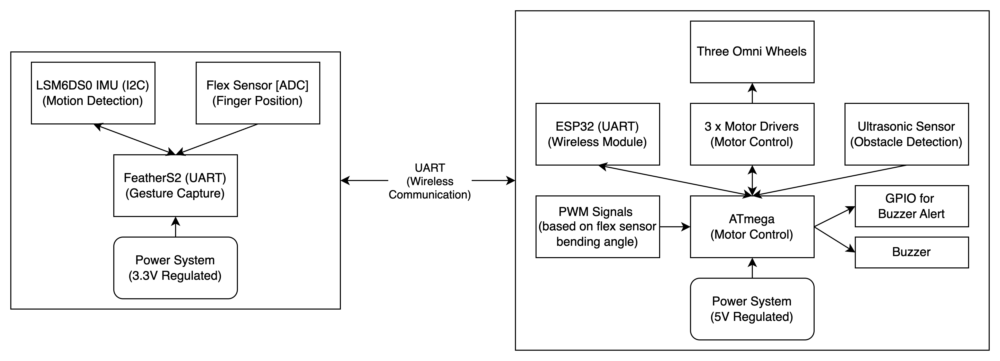
Our system consists of two primary subsystems: the **Gesture Capture System** and the **Motor Control System** for the OmniBot. They utilize various communication protocols including I2C, ADC, UART, PWM, and GPIO. Additionally, regulated power supplies are integrated into both subsystems to deliver stable voltage levels.

The **Gesture Capture System** is centered around FeatherV2/FeatherS2, which manages both sensor inputs and wireless data transmission. It will handle gesture capture by interfacing with the LSM6DS0 IMU and Flex Sensor, while simultaneously transmitting control data to the OmniBot's ESP32 module via UART.

LSM6DS0 IMU is responsible for detecting hand motion and orientation. It uses the I2C to communicate with FeatherV2. The Flex Sensor detects the degree of bending in the user's fingers, then it generates an analog voltage that is read directly by the FeatherV2’s ADC. The ADC values are mapped to speed control commands, allowing different modes of motor speed with intuitive control. A FeatherS2 will be used to receive the data from the FeatherV2 via ESP-NOW and transmit the IMU values to the ATMega via SPI.

The **Motor Control System** is built around the ATmega328PB microcontroller, which handles motor control, obstacle detection, and alert systems. The FeatherS2 is mounted on the OmniBot and is the wireless receiver, communicating with the FeatherV2 on the wearable controller.

Motor control is achieved using two motor drivers (each driver can control 2 motors) that interface with ATMega. The motor drivers then manage the three omni wheels respectively, enabling movement in multiple directions. The ATMega generates PWM signals that control the direction of the motors and the speed is controlled through the duty cycle. The duty cycle will dynamically adjust based on the bending angle from the flex sensor and motor direction will change depending on the hand motion detected from the IMU.

The rover also features an ultrasonic sensor for obstacle detection. The sensor communicates with ATMega using GPIO pins for both the trigger and echo signals. When an obstacle is detected within a specified range, the ATMega will activate a buzzer via a dedicated GPIO output, alerting the user of the presence of an obstacle.

For the communication protocol, I2C links LSM6DS0 IMU to FeatherV2. The ADC on FeatherV2 is used to read variable voltage signals from the Flex Sensor. ESP-NOW is employed for wireless communication between the two Feather boards. ATMega generates PWM signals at different duty cycles to modulate motor speed and direction. GPIO connections are used for the ultrasonic sensor and the buzzer.

For power regulation, the Feather requires a 3.3V regulated power supply. Meanwhile, the 5V regulated power supply in the rover system delivers stable power to the ATMega328PB, motor drivers, ultrasonic sensor, and buzzer. A 6V battery is used to power our entire system. The motors we use are 6V and are able to pull as much current as needed from the battery pack. A 5V voltage regulator is used to buck down the 6V to 5V for our ATMega and peripherals. This separation of power systems ensures reliable performance, minimizes electrical noise, and protects components from voltage instability.

### 4. Design Sketches

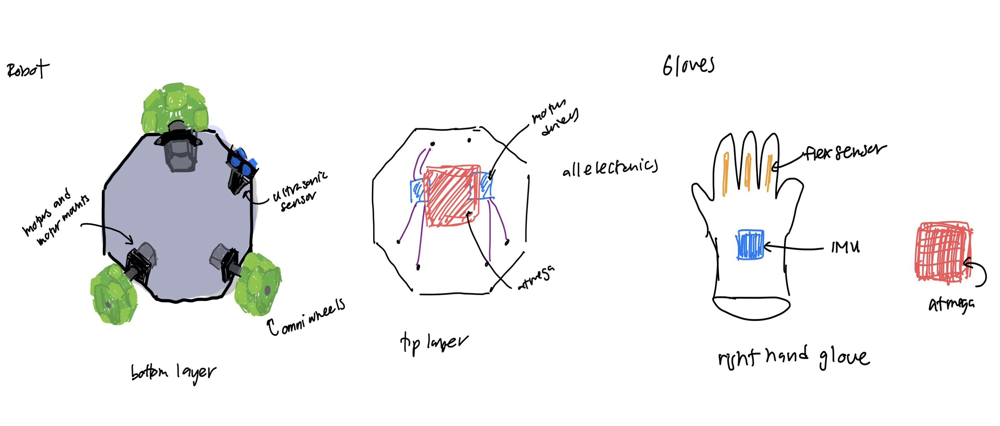

For our design, the OmniBot's base uses omni wheels for enhanced motion in multiple directions. The use of an ultrasonic sensor for obstacle detection ensures improved environmental awareness. The top layer of the robot houses all essential electronics, including the ATMega board, motor drivers, and power distribution system. On the glove controller, the IMU is positioned centrally on the back of the hand to accurately detect wrist movements, and the flex sensors are embedded along the fingers to track bending angles for speed control.

### 5. Software Requirements Specification (SRS)

The software for the gesture-controlled rover robot will be able to process real-time motion and detect different gestures, wirelessly transmit commands, and be able to precisely control the rover. This can be broken down into three different subsystems:  gesture controller, rover control system, and collision detection system. The wearable gesture controller detects user gestures and transmits these movements wirelessly. The rover control system will be able to intercept these commands and control the rover's movement using predefined gesture mappings. The collision detection system monitors the rover/s surroundings and alerts the users of any obstacles. Key requirements include gesture recognition accuracy, reliable wireless communication, precise motor control, and responsive collision detection

**5.1 Definitions, Abbreviations**

*IMU (Inertial Measurement Unit):* A sensor that combines an accelerometer and a gyroscope to track orientation, acceleration, and angular velocity. In this project, it is used to detect hand gestures such as tilts and wrist rolls.

*Flex sensor:* A sensor that changes its resistance based on the amount of bending or flexing. It is used here to detect finger position and aid in gesture control.

*Feather ESP32:* The wireless communication module using ESP-NOW to transmit data between the wearable controller and the robot.

*Ultrasonic Sensor:* A distance sensor that uses sound waves to detect objects. It is used here for obstacle detection on the robot.

**5.2 Functionality**

<table>
  <thead>
    <tr>
      <th style="width:100px;">ID</th>
      <th>Description</th>
    </tr>
  </thead>
  <tbody>
    <tr>
      <td>SRS-01</td>
      <td>The IMU and flex sensors shall track predefined hand gestures (forward, backward, left, and right tilt, wrist roll, and open palm) within 200ms.</td>
    </tr>
    <tr>
      <td>SRS-02</td>
      <td>The ATmega328PB shall process the IMU data and classify gestures based off of certain threshold values correctly.</td>
    </tr>
    <tr>
      <td>SRS-03</td>
      <td>The ESP32 will transmit gesture data from the user to the robot with latency &lt; 200ms.</td>
    </tr>
    <tr>
      <td>SRS-04</td>
      <td>The robot shall have three speed modes controlled based on the angular velocity detected from wrist rolling.</td>
    </tr>
    <tr>
      <td>SRS-05</td>
      <td>The ultrasonic sensor shall detect obstacles within 5–100 cm. If an obstacle is within 20 cm, the robot will stop, ignore commands, and the LED will turn red. Once cleared, the robot resumes movement, and the LED turns green.</td>
    </tr>
    <tr>
      <td>SRS-06</td>
      <td>The entire system will run independently on the ATmega328PB without the need of an external computer.</td>
    </tr>
    <tr>
      <td>SRS-07</td>
      <td>If wireless connection is lost, the robot shall automatically stop within 500ms.</td>
    </tr>
  </tbody>
</table>

### 6. Hardware Requirements Specification (HRS)

The hardware for the gesture controller rover will allow it to move freely in many directions as well as sense the motion of the controller. Additionally, it will be able to sense obstacles ahead using an ultrasonic sensor.

**6.1 Definitions, Abbreviations**
*Feather ESP32:* Board for wireless communication

*ATMega328PB:* Main microcontroller on the rover

**6.2 Functionality**

| ID     | Description                                                                                              |
| ------ | -------------------------------------------------------------------------------------------------------- |
| HRS-01 | The rover must be able to run for at least 15 minutes continuously.                                       |
| HRS-02 | The ultrasonic sensor must be able to accurately detect obstacles within 5-100 cm.                       |
| HRS-03 | The motors must be able to move the rover at varying speeds.                                              |
| HRS-04 | The rover must be able to move in perpendicular directions without needing to turn using the omni wheels. |
| HRS-05 | The flex sensor must be able to control the speed of the rover using an ADC.                              |
| HRS-06 | Motion of the IMU must translate into motion of the rover.                                                |
| HRS-07 | The two ESP32 boards must be able to wirelessly communicate with each other directly.                     |
| HRS-08 | The ESP32 and ATMega328PB must be able to communicate using SPI.                                          |

### 7. Bill of Materials (BOM)
This is a general list of our bill of materials. A more detailed list can be found [here](https://docs.google.com/spreadsheets/d/1VVz9bghLVpC_rwVTz9ZApd166kRQwFx1JgdSo3LERfQ/edit?gid=253149064#gid=253149064). We used an ATMega329PB, Feather ESP32 V2, Feather ESP32 S2, LM6DS0 IMU, US-10 Ultrasonic sensor, 3 6V Polulu motors with motor mounts and enocder wires, 6V battyer, 2 DRV8871 motor drivers, and 3 omni wheels.

### 8. Final Demo Goals

On Demo Day, we will build an obstacle course for our rover to test in. Someone will wear the controller and manuver the rover around obstacles. Part of the test will include getting close to an obstacle and stopping before a collision. The test will conclude when the rover is successfully able to get to the end of the obstacle course.

### 9. Sprint Planning

| Milestone  | Functionality Achieved                                                                                                                                                                                                                                                                                           |
| ---------- | ---------------------------------------------------------------------------------------------------------------------------------------------------------------------------------------------------------------------------------------------------------------------------------------------------------------- | --------------------------------------------------------------------------------------------------------------------------------------------------------------------------------------------------------------------- |
| Sprint #1  | 1. Developed Wearable Controller Prototype using the FeatherS2. 2. Implemented motion sensing algorithms with the  LSM6DS0 IMU. 3. Integrated the Flex Sensor for ADC-based speed control. 4. Developed basic motor control firmware for the ATmega using PWM signals for speed and direction. | 
| Sprint #2  | 1. Established UART Communication between the two FeatherS2 boards. 2. Integrated gesture detection logic with motor speed control via PWM signals. 3. Assembled hardware components: Motor Drivers, Omni Wheels, and Power Systems. 4. Conducted movement tests to verify functionality.      |
| MVP Demo   | 1. Developed and tested the Ultrasonic Sensor with the ATmega328PB. 2. Integrated obstacle detection logic to trigger the Buzzer via GPIO. 3. Refined gesture detection algorithms to improve accuracy. 4. Fine-tuned Flex Sensor ADC values for smoother speed control.                      | 
| Final Demo | 1. Conducted full system integration for all subsystems. 2. Performed system calibration for accurate motion control, speed adjustment, and obstacle detection. 3. Conducted extensive performance testing for stability.                                                                           |

### Prototyping Images
<!-- row 1 -->

  

    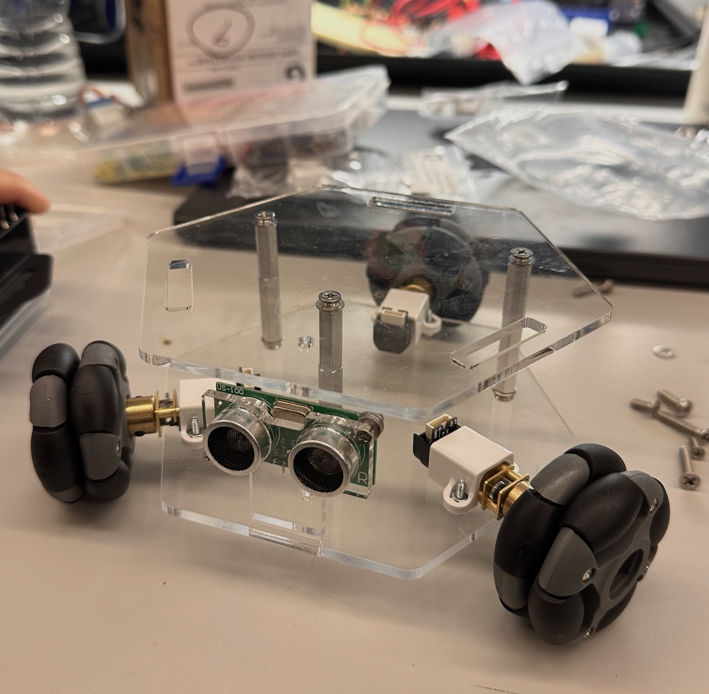 
    Robot Chassis
  

  

     
    Flex Sensor Wiring
  

  

     
    Flex Sensor ADC
  

  

     
    Motor Driver Setup
  

 

<!-- row 2 -->

  

    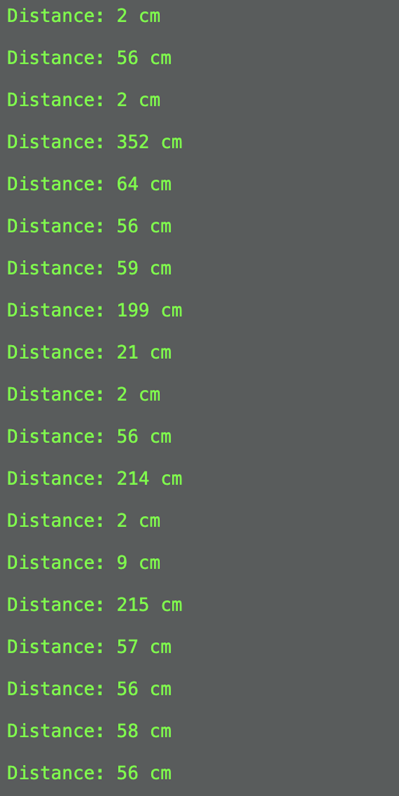 
    Distance Measurements
  

  

     
    IMU Calibration
  

  

    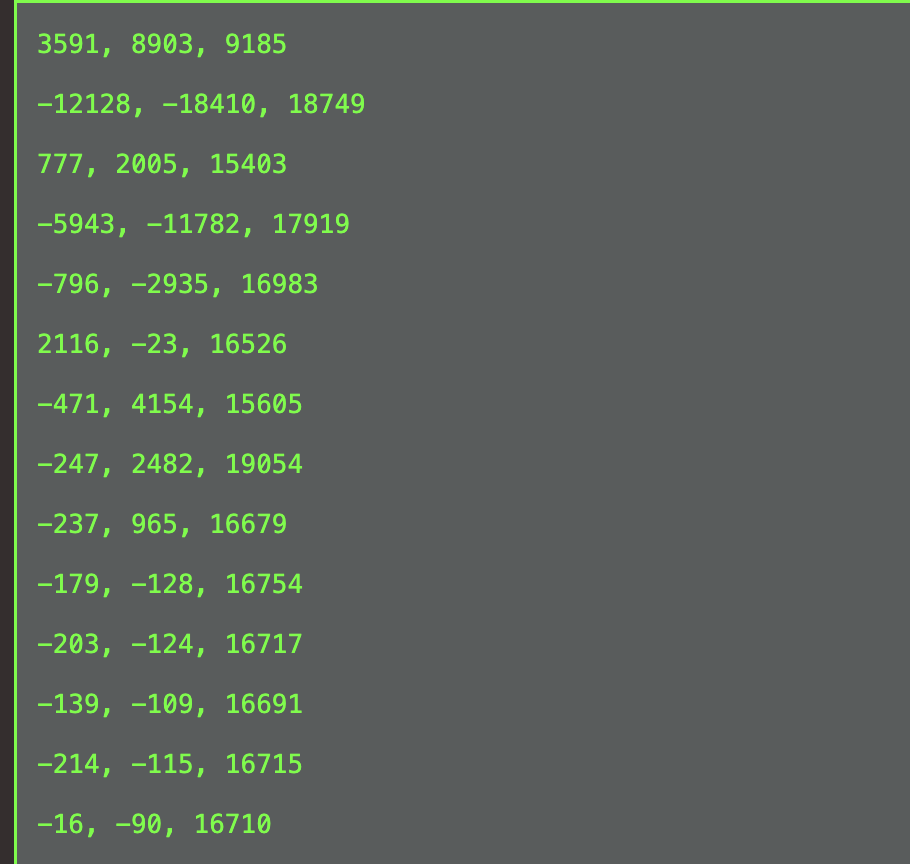 
    IMU Calibration Output
  

  

     
    Feather S2 on OmniBot
  

 

<!-- row 3 -->

  

     
    Motor Assembly
  

  

     
    Integration
  

  

     
    Testing!!
  

  

     
    MVP Assembly
  

 

### Wiring Diagrams

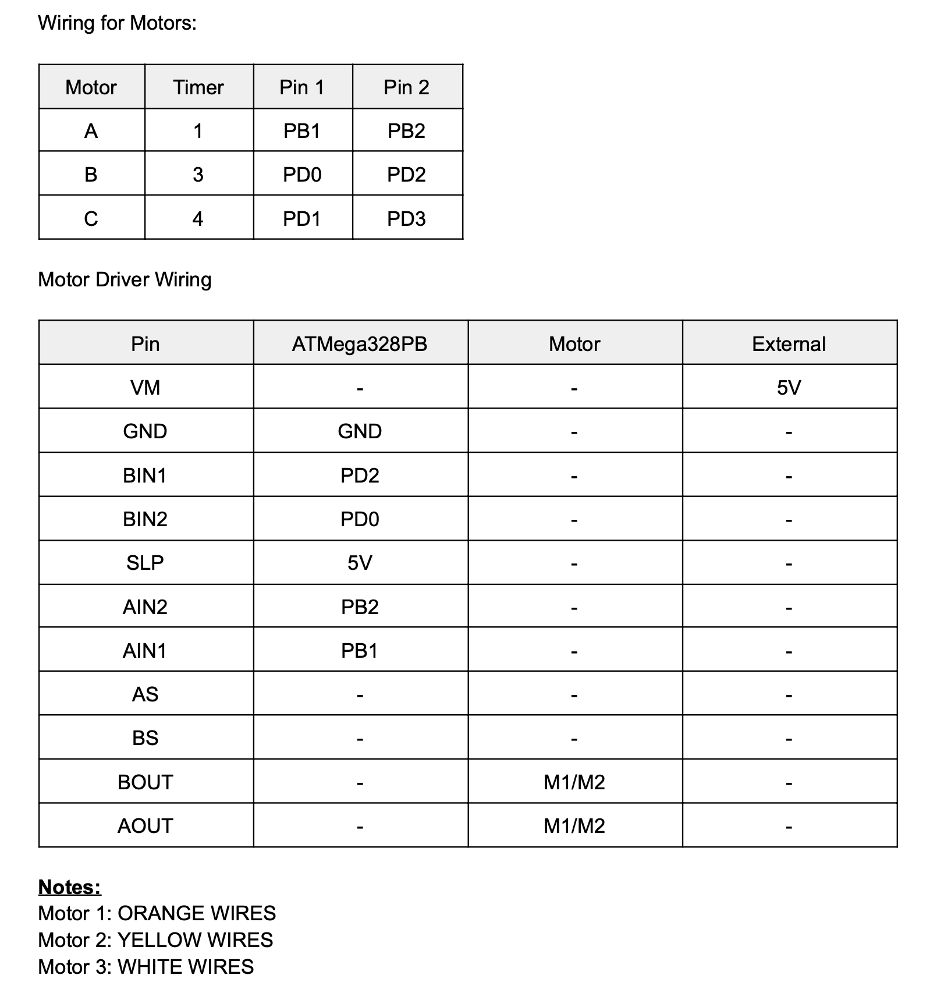

IMU Calibration Data

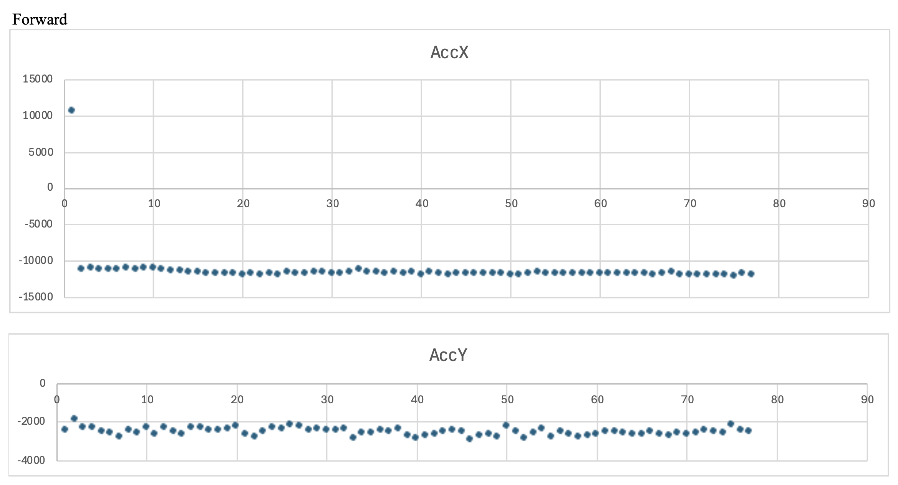

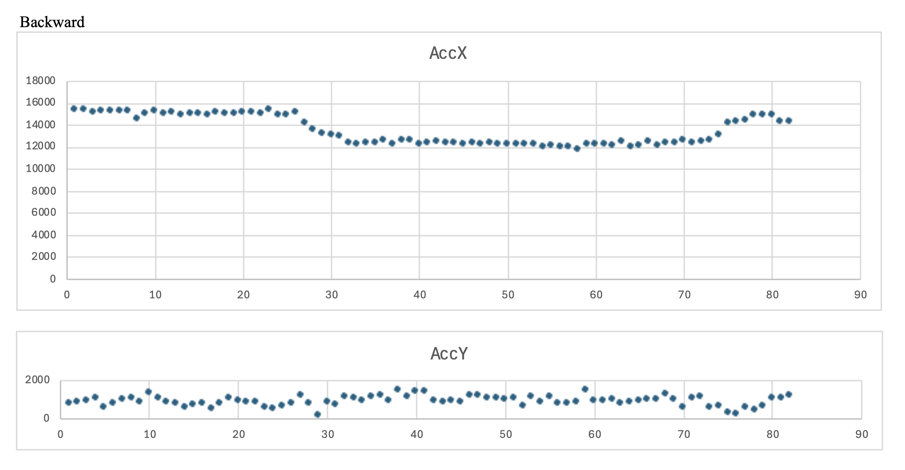

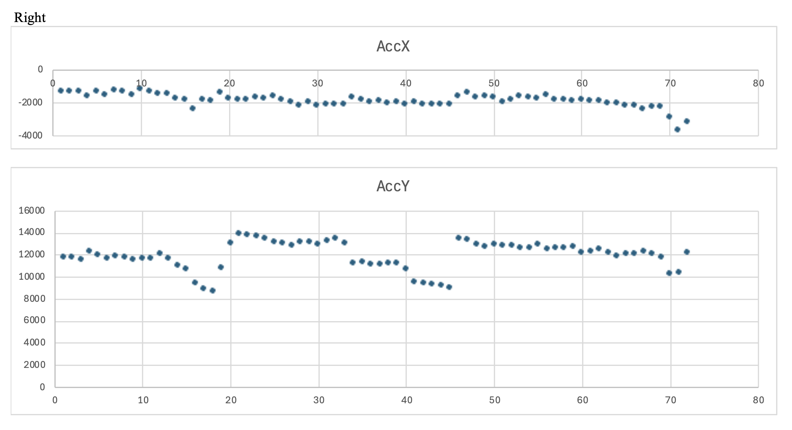

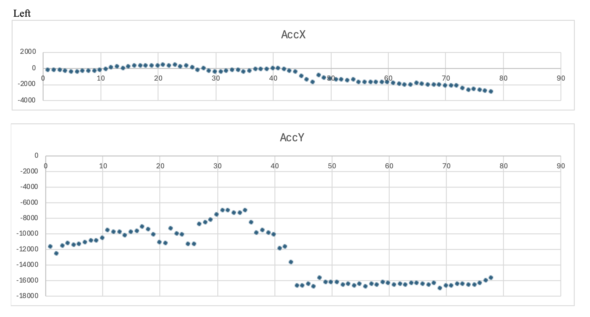

Based on the above data collected, our calibrated control for IMU is:

if (x < -7500 && y > -4000 && y < 4000) → "move forward"  
if (x > 7500 && y > -4000 && y < 4000) → "move backward"  
if (x > -4000 && x < 4000 && y > 7500) → "move right"  
if (x > -4000 && x < 4000 && y < -7500) → "move left"  

### **Final OmniBot**

  <iframe width="700" height="400" src="https://www.youtube.com/embed/BRfWkiYQ0kc" frameborder="0" allow="accelerometer; autoplay; clipboard-write; encrypted-media; gyroscope; picture-in-picture" allowfullscreen></iframe>

We were successfully able to complete our entire project and have a reliable working demo. Our final OmniBot was able to move in all four basic directions based on the tilt of the controller. It could also stop if an obstacle was detected in front of it. When this obstacle is detected, the buzzer will sound to alert the user, and the user can only move the OmniBot backward, left, and right. Many of our classmates and friends played around with the OmniBot and found it very fun!

**Technical Details**
**Robot Movement**: 3 timers were configured to drive the motors. Timer 1 is used for Motor 1, Timer 3 is used for Motor 2, and Timer 4 is used for Motor 3. These three timers are all 16-bit timers which make the configuration of each motor identical. For timer 1, we use two OCRA/B values to send different PWM signals to control the direction and speed. For timer 3 and 4, we found that the second OCRB pin overlapped with each other (both used PD2 on the ATMega), thus we use one PWM pin to output variable duty cycles and a GPIO direction pin sets motor direction (HIGH/LOW). We wrote custom functions such as `move_forward()`, `move_backward()`,` move_left()`, and `move_right()` for each direction of the robot. Each function will send different duty cycles to each wheel to control it in the four basic directions. To control the speed, the ratio of duty cycle for each wheel can be scaled up or down. Since the robot is three-wheeled, we accounted for the drift of the robot through a `drift_correction()` function or else the robot will make a lot of circles instead of going in the desired direction! If the left or right direction is detected,  `drift_correction()` will be called which alternates the PWM outputs of one motor slightly back and forth to "steer" the OmniBot towards a straighter left or right direction. This happens periodically. We implemented directional states, so the OmniBot can keep track of which direction it is currently going in and only changes motor movements if a new state is detected from the user IMU controller.

**IMU Calibration**: To implement the IMU so that the OmniBot can move based off of the IMU tilting degree, we collected data for the x and y acceleration values on the IMU at different tilting degrees. We plotted these values, shown in earlier figures, to determine different classification values. We were able to observe clear differences of the x and y acceleration when the IMU was stationary or tilted. We also observed that as the degree of tiling increases, the absolute value of the IMU output also increases. With these values, we were able to implement conditional clauses that call the right direction functions to activate the correct PWM signals and duty cycles for the respective motors.

**Controller**
The controller is composed of the IMU, which is communicating the accelerometer data to the Feather ESP32 V2 via I2C. This data was calibrated through processing several datasets of both the x and y accelerometer data depending on the tilting of the IMU, as discussed above. Once the IMU is calibrated, then the robot can correctly identify the tilt of the controller and act accordingly. Through creative soldering, we were able to make the controller as small as the Feather ESP32 S2 which is roughly 2.5 in x 1 in (super small!).

**Communication**
The IMU is collecting the accelerometer data from the controller. This data is sent processed in the Feather ESP32 V2 and sent to the Feather ESP32 S2 on the robot, wirelessly, through the ESP-NOW protocol. The Feather on the robot then communicates the data it received to the ATMega328PB through SPI, so the robot can act accordingly.

**Ultrasonic Sensor**
There is an ultrasonic sensor mounted on the front of our robot. When it detects a distance less than 20cm, it will sound a buzzer and will not let you move forward even if the controller is in the forward position. The robot will only be able to move back, left, and right until it is clear of the blocking object. The buzzer we are using is an active buzzer which beeps if the pin is in the HIGH state. We use polling and not interrupts so that the ATMega continuously checks the ECHO pin to see if the distance is below threshold value.

### Final Images

**Overall Look**  

**Front View**  

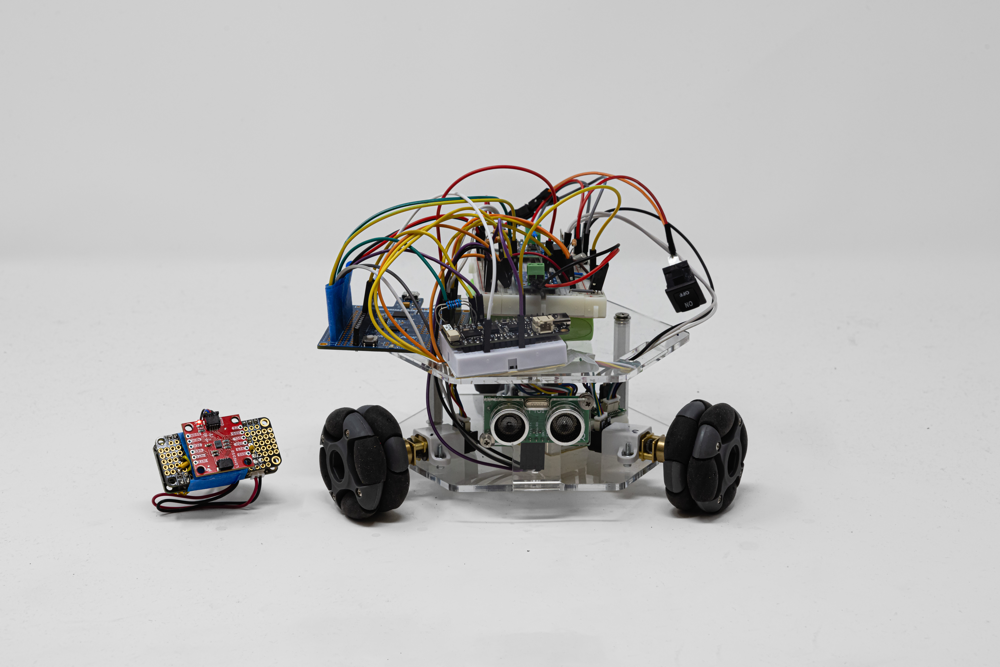

**Back View**  

**Top View**  

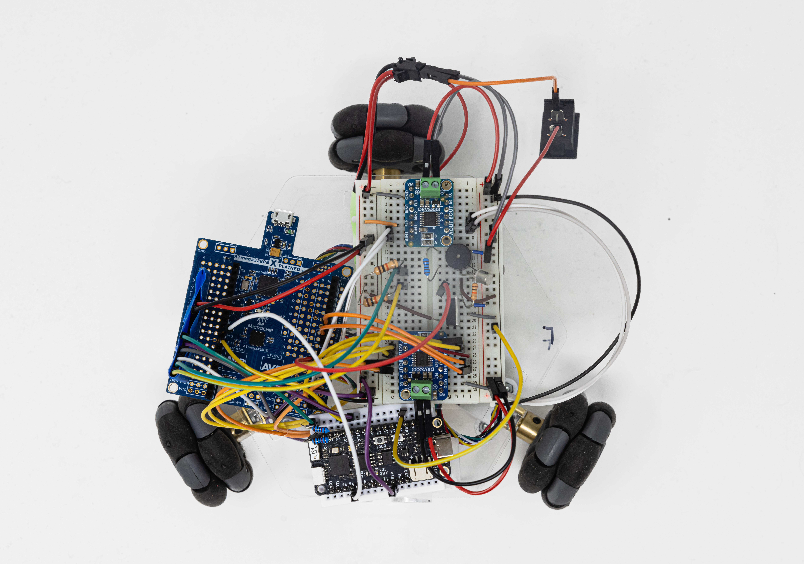

**Bottom Layer Details (Motors)**  

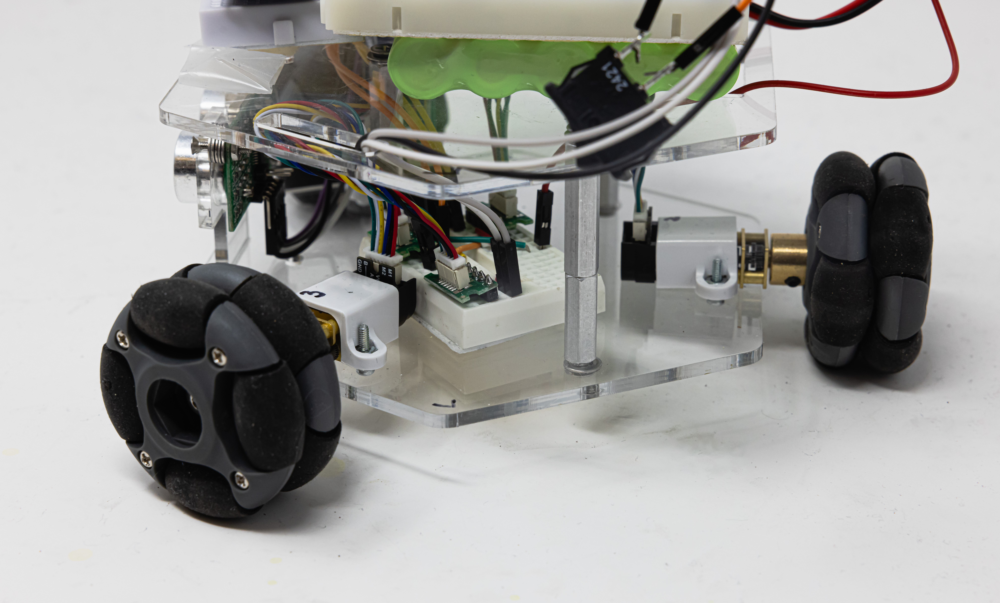

**IMU Detail**  

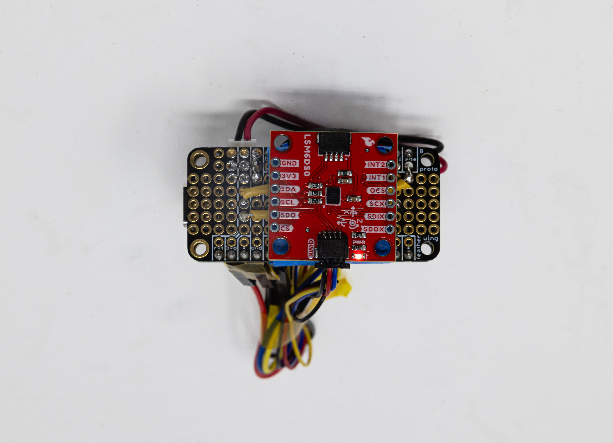

### References

Fill in your references here as you work on your final project. Describe any libraries used here.

In our MPLAB code, we used the standard C libraries including "stdio.h", for input output, "avr/io.h" and "avr/interrupt.h", for standard avr and interrupts, and "util/delay.h", for delays.

In our Arduino code for our IMU and Feather communication via I2C and Feather to Feather communication through ESP-NOW, we used the libraries "Wire.h", "esp_now.h", and "WiFi.h". "Wire.h" enables the I2C communication between the IMU and the Feather. It interfaces with the SDA and SCL lines of the IMU. We use "esp_now.h" to implement the ESP-NOW protocol which allows us to communicate from one Feather to another by sending and receiving data packets. The "WiFi.h" library is used to manage the Wifi connections that are needed for the ESP-NOW communication in the "esp_now.h" library.

### Conclusion

#### 1. What did you learn from it?

One of the key takeaways from this project was the importance of thoroughly mapping out all the internal components of the ATmega328PB  before starting integration. The chip has a limited number of shared resources, such as timers, and in our final design, we ended up using four of the five timers for various functions, including motor control, SPI communication, and the buzzer for the ultrasonic sensor. Because some timers are 8-bit while others are 16-bit, and each has different capabilities, it’s crucial to plan and communicate clearly which timers are assigned to which modules. We configured timers 1, 3, and 4 for the motors because they are all 16-bit timers which would make the motor configuration mostly the same for all three motors. Without proper planning, overlap usage would likely occur which would then require significant code changes, slowing down the integration process.

Another important takeaway was learning how unpredictable embedded systems development can be. Sometimes, components fail or behave unexpectedly, and pinpointing the root cause requires extensive testing and debugging. This includes probing signals with an oscilloscope and stepping through code carefully. For instance, when none of our motors were responding during SPI integration, we eventually discovered that the uart_init() function was unintentionally reconfiguring the timers used for motor control. Once, we commented out that line, everything worked!!

#### 2. What went well?

The IMU went well in controlling the direction of the robot's motion. It was able to distinguish each direction smoothly without confusion. The ultrasensor is also detecting object accurately without making annoying unwanted noises. Since we carefully assign the timers to motors and ultrasonic sensors and that the SPI communication did not require a timer, no integration conflict happened for the timers. Some pins had to be adjusted during integration, but eventually, we're able to utilize the correct PWM pins and GPIO pins correctly. The power manaagement for the robot (6V) battery was really successfully, since we didn't need to recharge it for the entirely of our project, which proves its durability.

Aside from that, the initial mechanical part in designing the robot's structure is also pretty successful since it's very steady when we're testing the robot, and the support for the ultrasonic sensor press-fit well wihout ever falling.

#### 3. What accomplishments are you proud of?

Our motors are able to transition very smoothly and react fairly between changes in directions. A big part of this was implementing *direction states* in the code. Initially, the motors would "think" every second and decide what direction they would move in. However, after implementing states, if the direction is the same, then the motors will continue to move in the same direction without stopping. This resulted in better transitions between different direction states as well as more control of the robot. Additionally, the given that it is a 3-wheel omnidrive robot, it is able to move left and right well. We implemented a drift_correction function that corrects for drift if it detects that the robot is moving left or right. This lets the robot move successfully to the left or right without making a circle.

#### 4. What did you learn/gain from this experience?

From this experience, we learned how to integrate multiple hardware subsystems into an integrated embedded system. It also helped us learn how each individual parts might interact in unexpected ways when combined. We gained how import UART debugging is. the feather SPI communication has been quite a big issue for us, since the high and low bits tend to mess around with each other, which output us completely random results on the serial monitor. Then, we print our the feather V2, S2 output and the signal that atmega's receiving separatingly on both arduino and MPLab. We also printed low and high bits separately and figured out the issue. We also learned how to structure data packets between two ESP32 Feather S2 boards.

We also learn more about the control and kinematics of three-wheel motion control. The robot is symmetric moving forward/backward, hence motion control is quite straightforward. However, for left and right motion, we implemented a drift motion of the third wheel that compensates for the error in motion. We also read some literature about kinematics of three wheel motion and its vector applications with encoders, but the algorithm is too complicated under the timeline, hence we'll plan to implement that for future explorations.

We also learned that integration was a very important step. Although all stages worked well separately, putting them all together usually produces unexpected behaviors. For instance, UART would crash the entire motor motion setup program, so that we have to test print statements and motions separately. But overall, we learn how to manage PWM signals, especially when dealing with multiple timer; the I2C and SPI communication between IMU, feather, and ATmega; using ADC pins and GPIO pins; using UART for debugging and verfication for separate stages etc.

##### 5. Did you have to change your approach?

We initially intended this robot to be controlled with the movements of your hand using a glove-mounted IMU. However, since we didn't order the glove hardware, we redesigned it to use a small Feather-sized controller instead. This means we couldn't implement the flex sensors that were originally planned to control the robot's speed.

The speed control would have required dynamically adjusting the ratio between the left and right motor duty cycles. This presents a problem because our drift correction function relies on very specific motor pulses. The correction works by applying brief, low-power motor pulses (just 48-55 duty cycle) that are barely strong enough to overcome static friction. If we tried to scale down the overall speed, these correction pulses would become too weak to overcome friction. At that point, the robot would lose its ability to drive straight and would instead start turning in circles because the drift correction would fail. Forward and backward pose no issue to speed control, but left and right have difficulty because of the drift correction. In further iterations, if we use encoder feedback to drive the left and rightward motion, then we will be able to adjust speed based off of the change in acceleration over time of the IMU.

#### 6. What could have been done differently?

We should have added more debugging checkpoints throughout the system before integration. This would have made it easier to test each component individually and quickly identify issues. Instead, we only added these debugging tools (like print statements on both Feathers and the ATMega328PB) after integration problems arose, which slowed our progress. Some key debugging features we implemented late included:

    * IMU data transfer verification
    * Direction classification checks
    * Ultrasonic sensor distance readings
    * LED indicators for motor activation

Additionally, we could have maintained a document listing frequent problems and their solutions. This would have saved time by preventing redundant debugging of issues we'd already solved.

#### 7. Did you encounter obstacles that you didn’t anticipate?

We didn't anticipate the communication between the robot and controller to take as long as it did. We accidentally used two different versions of the Feather. The Feather connected to the IMU is the ESP32 V2 version and the Feather on the robot is the ESP S2 version. We didn't realize that we were using two different versions, and the S2 code isn't able to run on the V2 version because it uses newer Arduino code that is not compatible with V2. After realizing that we are using two different versions and the Arduino code is not compatible, we were able to rewrite the FeatherV2 code so that it can communicate properly with the IMU via I2C. As for the Feather S2 communicating with the ATMega328PB through SPI so that the motors can react to the IMU position, we were sending over 2 8-bit packets of data to be processed by the ATMega. We found that sometimes, the x and y acceleration values printed in uart, after processed by the ATMega, followed the values we saw when calibrating the IMU. However, other times we found that the values were totally arbitrary which confused us a lot! We spent a of time debugging, and ended up realizing that when the Feathers reset, the high and low data packets may switch, so we have to process the values on the ATMega slightly differently depending on each case.

#### 8. What could be a next step for this project?

The next steps of the project can include integrating a smoother transition between different moving states of the robot. Currently, it is able to move forward, backward, left, and right and transition smoothly between these states. If we study the kinematics of a three wheel omnidrive robot more, we can implement smoother control of the robot. We can probably take the x and y vectors sent over by the IMU, and use a formula to calculate the direction of the controller, from this we can adjust the PWM and duty cycle of each motor so the robot moves in the desired direction. Additionally, the ultrasonic sensor requires a bit of thinking before it beeps and stop the robot. We could potentially integrate the sensor in a different way where it takes less time to think and can act quickly.

We can also work on reducing the bulkiness of the robot. The top of the robot has multiple breadboards to house the Feather, motor drivers, and ATMega328PB. We tried to use a protoboard to reduce the bulkiness; however, when we were testing this newly soldered, second set of components, it seemed that everything was shorting each other as the multimeter read 0V between VCC and GND. We are still unsure why this is happening, because our soldering joints were very precise and small, but we hope we can find a better solution to make the overall robot look better and weigh lighter.
